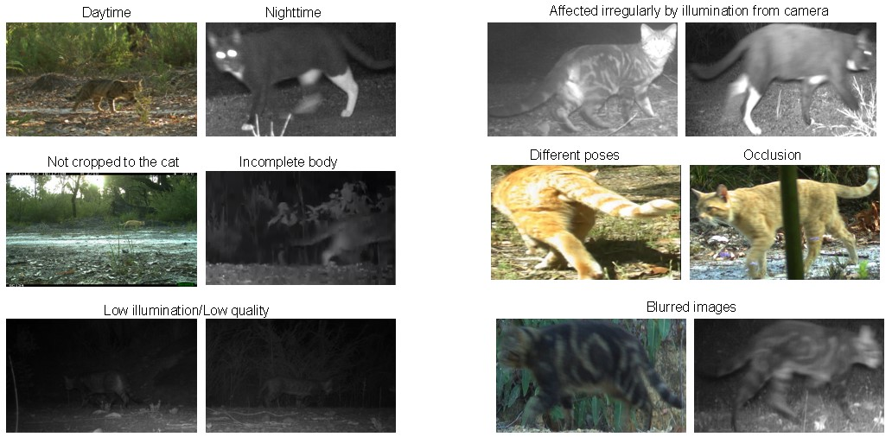

# PPGNet-Cat

 This is a Re-ID model able to identify feral cats in the wild. It was built based on <a href="https://github.com/LcenArthas/CVWC2019-Amur-Tiger-Re-ID/tree/master">PPGNET</a>, which was utilised in the identification of Amur tigers (Siberian tigers). Feral cats make a devastating impact in the Wildlife in Australia as well as around the world. Their identification is mostly done using camera traps in different locations and context, however, the individual identification is a tedious and extensive work, where ecologist try to recognize specific marks to discriminate and monitor a specific individual. This model seeks to contribute with the identfication of these animals, supporting monitoring and tracking tasks. 

# Feral cat images

 Images from camera traps are affected by different conditions. Overall the resolution of these images is 2048x1440 and 1920x1080 pixels. Below, there are some examples of images taken from a monitoring activity in Western Australia. Images were provided by Thylation and the Departmnet of Biodiversity, Consevation and Attractions (DBCA) of Western Australia. 

