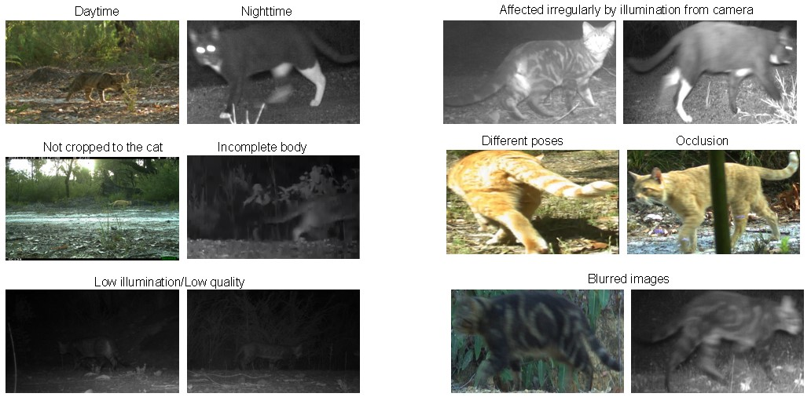

# PPGNet-Cat

<p align="justify"> This is a Re-ID model able to identify feral cats in the wild. It was built based on <a href="https://github.com/LcenArthas/CVWC2019-Amur-Tiger-Re-ID/tree/master">PPGNET</a>, which was utilised in the identification of Amur tigers (Siberian tigers). Feral cats make a devastating impact in the Wildlife in Australia as well as around the world. Their identification is mostly done using camera traps in different locations and context, however, the individual identification is a tedious and extensive work, where ecologist try to recognize specific marks to discriminate and monitor a specific individual. This model seeks to contribute with the identfication of these animals, supporting monitoring and tracking tasks. </p>

# Feral cat images

<p align="justify"> Images from camera traps are affected by different conditions. Overall the resolution of these images is 2048x1440 and 1920x1080 pixels. Below, there are some examples of images taken from a monitoring activity in Western Australia. Images were provided by Thylation and the Departmnet of Biodiversity, Consevation and Attractions (DBCA) of Western Australia. </p>



# Dependencies

The main dependencies used in this project are:

* scikit-learn                  1.3.0
* torch                         2.0.1+cu118
* torchmetrics                  1.0.3
* torchvision                   0.15.2+cu118
* pytorch-lightning             2.0.6
* pytorch-metric-learning       2.3.0
* opencv-python                 4.8.0.74
* numpy                         1.24.3
* albumentations                1.3.1
* pandas                        2.0.3
* Pillow                        10.0.0

# Code workflow

<p align="justify">In order to ensure a clear and right execution of the code, it is recommended to follow the next steps:

* **1) Organize the data**: The data should be arranged in the **data** folder in the next way:
  * In **data/train** is necessary to count with the next three elements:
     * **images**: A folder with the images available for training. These images are in .jpg.
     * **keypoints_train.csv**: CSV File with the coordinates of the keypoints of cats per image.
     * **train_anno.csv**: CSV file with the information of each class/entity per each image.
     
  * In **data/test** is necessary to have:
     * **images**: A folder with the images available for testing.
     * **gt_test_plain.json (optional)**: JSON file with the groundtruth of images. This is useful to evaluate the mode if it is needed.
  
* **2) Training**: For training just in necessary to run the script **train.py** able in the main directory. This process will create a **.pth** file with the weights and biases for our evaluation model.
* **3) Testing**: For testing, just in necessary to run the script **test.py** able in the main directory. This script will make the inference over all the test subset and return the performance of the model using mAP, Rank-1 and Rank-5.</p>

In order to store the weights given from your training process, you need to create the "pretrained_weights" folder in the next way.

```
PPGNet-Cat
          |--train.py
          |--test.py
          |--demo1.ipynb
          |--demo2.ipynb
          |--pretrained_weights
          |--remaining folders (datasets, losses, etc.)
```  


<p align="justify"> <b>Demo1</b>: There is a demo available (<b>demo1.ipynb</b>) to run the evaluation model over a set of 20 images randomly selected from our test subset (images are available in <b>data/sample</b> directory), creating the embedding of each image. The output of this script generates a <b>gif</b> animation with each one of the sample images and their estimated location in a two-dimension space after using 
 a <a href="https://github.com/lmcinnes/umap">UMAP algorithm</a> to reduce the 2560 embedding size to 2. Below there is an example of this process, where we can see how our model allocates images of the same entity close to each other and further from other groups. Here, each color represent a different entity.</p>
  


<p align="justify"> <b>Demo2</b>: A second demonstration (<b>demo2.ipynb</b>) is provided for executing the evaluation model on a collection of 20 images to produce embeddings for each image. By employing Cosine similarity, distances between each embedding are obtained. Subsequently, by manually establishing a threshold (e.g., set at 0.15), it becomes possible to ascertain whether two images depict the same or different cats.


<p align="justify">There is available the <a href="https://www.dropbox.com/scl/fi/5ipvmx1xos6vfpmac28io/best_model.pth?rlkey=bc0c2d2rlkteiird17vmmf3bg&dl=0">weights of PPGNet-Cat</a> in a .pth file. To use in testing, or to run the demos, you need to download this file and put it in the folder 'pretrained_weights'.</p>
